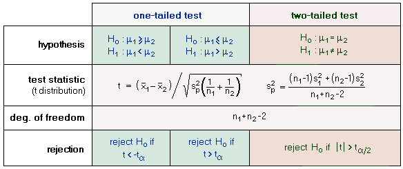
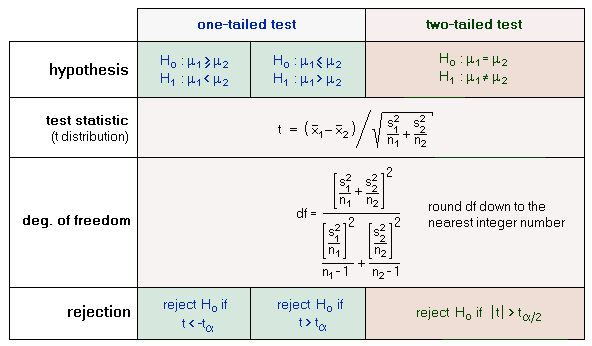

# t test

**In A/B testing you never know the population mean, you’re estimating it, so always use the t-test. For N>100, the t-test numerically yields the same results as the z-test.**

**"**We should use Welch’s _t_-test by default, instead of Student’s _t_-test, because Welch's _t_-test performs better than Student's _t_-test whenever sample sizes and variances are unequal between groups, and gives the same result when sample sizes and variances are equal."

#### **Student’s t-test:**

When the sample size is small, the assumption of the central limit theorem does not hold, since the estimates of  σ2 become unreliable. One therefore has to resort to the t-distribution. The t-test requires some constraints to be fulfilled:

* the variances have to be equal
* the samples have to be independent of each other
* the samples have to follow a normal distribution

Since we assume that σ12 and σ22 are equal, we can compute a pooled variance sp2. The rational for pooling the variances is to obtain a better estimate. The pooled variance is a weighted sum of variances. So when n1 equals n2, sp2 is just the average of the individual variances. The overall degrees of freedom is the sum of the individual degrees of freedom for the two samples:

df = df1 +df2 = (n1-1) + (n2-1) = n1+ n2 - 2.

In order to apply a two-sample t-test you should follow the scheme shown below:

<figure><figcaption></figcaption></figure>

#### **Welch’s t-test**

<figure><figcaption></figcaption></figure>

**Test statistic:** (x1 – x2)  /  (√s12/n1 + s22/n2)

**Degrees of freedom:** (s12/n1 + s22/n2)2 / { \[ (s12 / n1)2 / (n1 – 1) ] + \[ (s22 / n2)2 / (n2 – 1) ] }

The formula to calculate the degrees of freedom for Welch’s t-test takes into account the difference between the two standard deviations. If the two samples have the same standard deviations, though, then the degrees of freedom for the Welch’s t-test will be the exact same as the degrees of freedom for the Student’s t-test.

Typically, the standard deviations for the two samples are not the same and thus the degrees of freedom for Welch’s t-test tends to be smaller than the degrees of freedom for Student’s t-test.

## **Reference**






